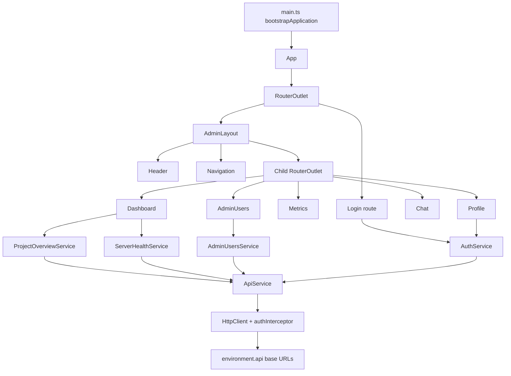

# Architecture

## High-Level Architecture

## Data Flow

Route components call feature services in `src/app/core/services`. Those services call `ApiService`, which builds URLs from `environment.api.baseUrl` unless a full URL is passed, as in `ServerHealthService`. `HttpClient` is provided with `authInterceptor`, which attaches the bearer token, refreshes through `auth/refresh` when needed, and retries `401` requests. Responses are mapped into typed models and then written into component or service signals.

## State Management

There is no global store library. State is held with Angular signals and `computed()` values inside services and route components. `AuthService` is the main shared state holder: it keeps the session in a signal, derives `profile`, `isAuthenticated`, and `hasAdminAccess`, and persists the session in `localStorage` under `admin_auth_session`. Login and profile forms use `ReactiveFormsModule`; async flows use RxJS operators such as `map`, `tap`, `finalize`, `catchError`, `switchMap`, and `shareReplay`.

## Rendering Pipeline

`main.ts` bootstraps `App` with `appConfig`. `App` renders only a `router-outlet`. Routes lazy-load standalone components; the protected root route renders `AdminLayout`, which always renders `Header`, `Navigation`, and a nested `router-outlet` for the active feature page.

## Package Dependencies

Runtime: `@angular/common`, `@angular/compiler`, `@angular/core`, `@angular/forms`, `@angular/platform-browser`, `@angular/router`, `@flaticon/flaticon-uicons`, `chart.js`, `ng2-charts`, `rxjs`, `tslib`. Dev: `@angular/build`, `@angular/cli`, `@angular/compiler-cli`, `jsdom`, `typescript`, `vitest`.
